# SpringBoot를 이용한 RESTful Web Service개발


어플리케이션 개발 방식에서 마이크로 서비스 아키텍처 사용

서비스를 작은 단위로 쪼개 개발하는 방식. 따라서 각 서비스들이 독립적으로 개발 가능해야 한다.

다른 기종으로 개발된 어플리케이션간의 데이터 통신을 위해 표준화된 HTTP 프로토콜을 사용하는 RESTful  서비스가 사용


### 사용기술
Spring Boot DevTools

Lombok

Spring Web

Spring Data JPA

H2 Database

***
# 0. Section : Web Service와  Web Application

### Web Service

www(world wide web)을 통한 장치와 장치 사이의 통신 서비스

즉, 네트워크 상에서 서로 다른 종류의 컴퓨터들 간에 상호작용하기 위한 소프트웨어 시스템

(webService는 기존 분산 프로그래밍 대신 xml을 사용하기 때문에 이기종간 사용이 용이! (RESTful보다는 복잡)

**주요 키워드 3개**

- 머신-머신 , 어플리케이션-어플리케이션 간의 상호작용을 위한 설계
- 플랫폼에 비의존적
- 어플리케이션간의 네트워크 통신 지원

### Web Application

서버에 저장되어 있고 웹 브라우저를 사용해서 실행하는 프로그램

인터넷 웹 브라우저 : HTTP 프로토콜로 통해 제공되는 html 문서를 해석해서 사용자에게 보여주는 어플리케이션

webApplication을 실행 할 수 있는 서버 = WAS

동작 외부 서비스 필요할경우 WAS를 거쳐 웹서버로 간다

webService에서는 xml / json 사용 하는데 더 문서의 양이 적은 json많이 사용!

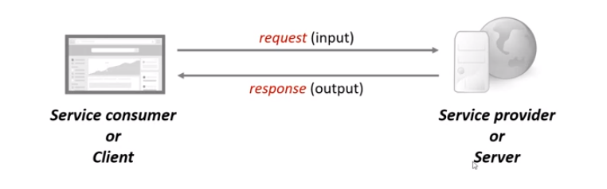

## SOAP vs RESTful API

SOAP : Simple Object Access Protocol

우리가 사용할 수 있는 프로토콜을 사용하여 xml 기반의 메시지를 컴퓨터 네트워크 상에서 전달할 수 있는 시스템

(즉, 통신 프로토콜을 위해 xml메시지 요청, 응답을 위한 시스템

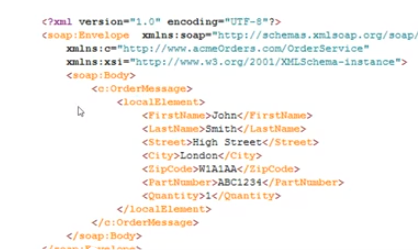
단점: 복잡성 (앞뒤 부가적인 )

오버헤드, 개발하기 어렵고, 무겁다

REST

플랫폼과 프로그램에 독립적, SOAP 보다 개발이 쉽다.

통신 방법의 하나로 상태 전달을 한다. 컴퓨터의 상태(자원의 상태 = 정보 값)

HTTP Method(GET,PUT,POST,DELETE) 를 통해 Resource를 처리하기 위한 아키텍쳐

REST API : 이런한 REST 방식을 제공하는 interface

RESTful :  REST API를 제공하는 웹 서비스

URI :  인터넷 자원을 나타내는 유일한 주소

- 접근 제한성과 시스템 아키텍처 구조에 맞는것 선택
- 사용되는 데이터 문세 포맷에 따라
- 서비스 정의 방법
- 전송 규약
- 구현 방법

# 1. Section : Spring Boot로 개발하는 RESTful Service

### Spring Boot란?

스프링 프레임워크에서 필요한 수많은 설정 방법 없이 최소한의 설정만으로도 플랫폼 , 라이브러리 사용가능.

- 단독실행가능한 스프링애플리케이션을 생성한다.,
- 실행을 위해 어플리케이션 필요없다.(내장형 톰캣, 제티 혹은 언더토우를 내장)
- 실행에 필요한 많은 API가 'starter'에 이미 포함(기본설정되어 있는 'starter' 컴포넌트들을 쉽게 추가)
- 다양한 설정 작업도 auto configuration 등으로 편리해 졌다.
- 설정을 위한 xml configuration이 필요없다. (설정을 위한 XML 코드를 생성하거나 요구하지 않음)

스프링 부트를 사용하기 위해선, @SpringBootApplication 실행하면 된다.

### Spring Initializr

이클립스 - SpringBoot / 인텔리제이 - Spring Initializr

Spring Boot DevTools

Lombok

Spring Web

Spring Data JPA

H2 Database

## SpringBoot 구조 확인 실행 방법

maven을 이용한 intellij 구조 확인

pom.xml : Maven 프로젝트 생성시 설정 담당 파일

clean : 파일을 지우는것

### HelloWorld Controller

RestController 생성

endPoint

@Data = Setter Getter ToString 등을 생성

## DispatcherServlet과 프로젝트 동작의 이해

[application.properties](http://application.properties) → 설정이름 = 값

application.yml → 설정이름 : 값

yml 파일이 더 가독성이 높고 작성하기 편리하다. ⇒직관적이고 적은양의 코드

```yaml
logging:
  level:
    org.springframework: DEBUG
 
logging level 조절 - >위와 같은 패키지에만 DEBUG 
```

**DispatcherServlet** :  사용자의 요청을 처리해주는 게이트 와 같은 개념

DispatcherServletAutoConfiguration : DispatcherServlet  관리

(클라이언트에게 결과값 반환시)

HttpMessageConvertersAutoConfiguration :  Json 포맷으로 변형 후 클라이언트에게 반환

Dispatch : 보내다, 파견

- 클라이언트의 모든 요청을 한곳으로 받아서 처리
- 요청에 맞는 Handler로 요청을 전달
- 요청에 맞는 Handlerd의 실행 결과를 Http Response 형태로 만들어서 반환

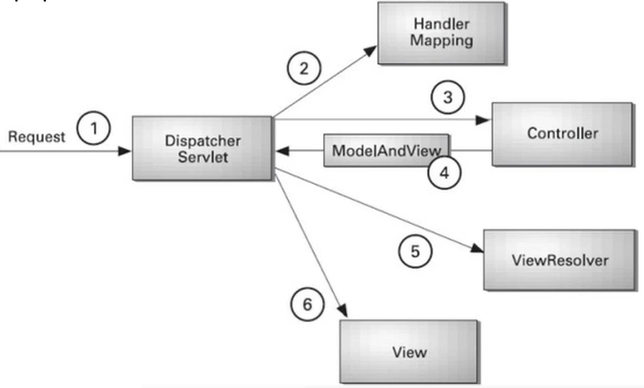
서블릿 컨테이너에서 Http 프로토콜로 들어오는 모든 요청을 처리하기 위해 제일 먼저 받는 FrontController역할 게이트 역할

즉 사용자 요청은 **DispatcherServlet** 에서 시작되어 **DispatcherServlet 로 끝난다.**

**RestController**

- Spring 4.0으로 부터 Spring xml으로 설정을 하지 않아도 Annotation을 사용해서 등록.
- @Controller +  @ResponseBody 의 기능을 가지고있다( 값을 body내에 )
- View 를 갖지 않는 REST Data(JSON / XML) 를 반환

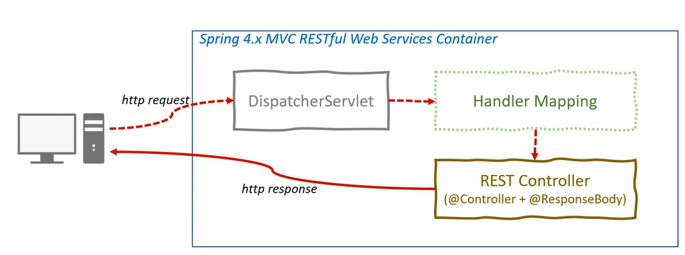
## Path Variable 사용

API이기 때문에 프로그래밍 사이에 약속되어있는 것!

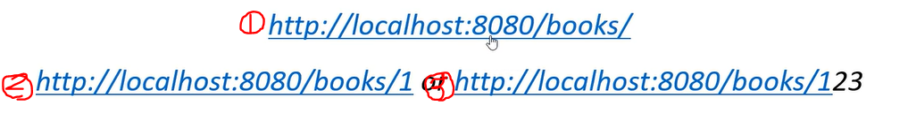
1번은 가변 데이터가 없는 반면, 2,3번은 가변 데이터가 URL에 들어가 있다. 이것이 path variable!

예시)

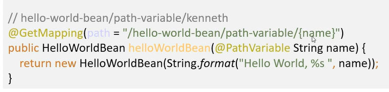
---

(2021 08 16)

# Section 2 : User Service API 추가

간단한 시나리오를 입혀 REST API 추가

- User Domain 생성
- Get , Post
- Exception Handling
- DELETE

### User 도메인 클래스 생성

Domain : 인간 활동 영역에서 사용되어지는 업무 지식.

이번 Section에서는 package로 나눈다.

비즈니스 로직은 주로 서비스 층에서 이루어짐.

데이터 베이스 관련된 코드 다루기 위해서는 Dao

### 사용자 목록 조회를 위한 API 구현 Get HTTP Method

Spring Container에 저장된 것들을 의존성 주입으로 가져온다.

의존성 주입은 생성자를 통해 주입하다.

@Service라는 걸 통해 용도를 알고 주입시 더 정확하게 주입된다.

@GetMapping 사용하여 멤버 리스트 조회 기능

### 사용자 목록 조회를 위한 API 구현 - Post HTTP Method

F12 번 개발자 화면에서 Network를 통해 상태코드 확인 가능

user 등록 메소드 추가

현재 우리는 REST API 만을 이용하기 때문에 view단이 없다.(form 이나 input이 없음) 이를 위해 postMan을 이용하여 확인.

### HTTP Status Code 제어

응답코드 제어하는 방법

ServletUrlComponentBuild class이용!

```yaml
@PostMapping("/users")
    public ResponseEntity<User> createUser(@RequestBody User user){
        User savedUser = service.save(user);

        //path에 주어진 가변변수에 새롭게 만든 id값을 넣는다.
        URI location = ServletUriComponentsBuilder.fromCurrentRequest()
                .path("/{id}")
                .buildAndExpand(savedUser.getId())
                .toUri();

        return ResponseEntity.created(location).build();
    }
```

하나의 단일된 성공 코드를 하지않고, 잘 조합해야한다.?

200뿐만 아니라 201등 여러 응답코드를 가지고


### HTTP Status Code 제어를 위한 Exception Handling

@ResponseStatus(HttpStatus.NOT_FOUND)

처리한 예외 => 404 오류로 정의

```java
//Controller
@GetMapping("/users/{id}")
public User retrieveUser(@PathVariable int id){
User user = service.findOne(id);
    if(user == null){
throw new UserNotFoundException(String.format("ID[%s] not found",id));
}
return user;
}

//UserNotFoundException
@ResponseStatus(HttpStatus.NOT_FOUND)
public class UserNotFoundException extends RuntimeException{
    public UserNotFoundException(String message) {
        super(message);
    }
}

```

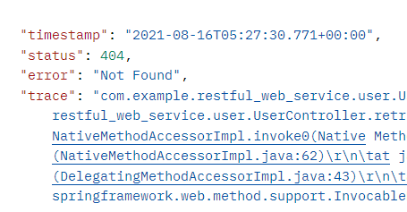

### Spring의 AOP를 이용한 Exception Handling

ExceptionResponse 생성 exception이 일어났을 때

responseEntity handler class 생성 exception이 났을때 handle 발생

공통처리 메소드를 위해 만드는 것이 좋다.

- **CustomizeResponseEntityExceptionHandler 추가**

**@ControllerAdvice 추가**

- 모든 controller 실행될때 반드시 **@ControllerAdvice** 선언한 bean이 실행

오브젝트 형태는 제네릭 필요없음

```java
@RestController
@ControllerAdvice
public class CustomizeResponseEntityExceptionHandler extends ResponseEntityExceptionHandler {

    @ExceptionHandler(Exception.class)//어디서 발생했는지
    public final ResponseEntity<Object> handleAllExceptions(Exception ex, WebRequest request){
        ExceptionResponse exceptionResponse =
                new ExceptionResponse(new Date(),ex.getMessage(),request.getDescription(false));

        return  new ResponseEntity(exceptionResponse, HttpStatus.INTERNAL_SERVER_ERROR);
    }
```

참고 WebRequest의

> getDescription(boolean includeClientInfo)
Get a short description of this request, typically containing request URI and session id.

@ExceptionHandler(Exception.class)

### 사용자 삭제를 위한 API 구현 - DELETE HTTP Method

iterator 타입 : 열거형 데이터를 가지고 있는 배열을 순차적으로 접근하기 위해!

# Section3

- Validation
- Internationalizationi
- XML format으로 반환하기
- Filtering
- Version 관리

## 유효성 체크를 위한 Validation API 사용

//따로 유효성 관한 starter 주입필요! 누락 되었을 수도 있으니깐 참고

```xml
<!-- https://mvnrepository.com/artifact/org.springframework.boot/spring-boot-starter-validation -->
        <dependency>
            <groupId>org.springframework.boot</groupId>
            <artifactId>spring-boot-starter-validation</artifactId>
            <version>2.5.2</version>
```

기존 Dto 의 하나인 User에 Validation관련 annotation추가

```java
@Data
@AllArgsConstructor
public class User {

    private Integer id;

    @Size(min=2)
    private String name;

    @Past
    private Date joinDate;

```

ResponseEntityExceptionHandler 안에 있는

```java
protected ResponseEntity<Object> handleMethodArgumentNotValid(MethodArgumentNotValidException ex, HttpHeaders headers, HttpStatus status, WebRequest request) {
        return this.handleExceptionInternal(ex, (Object)null, headers, status, request);
    }

	=>

@Override
    protected ResponseEntity<Object> handleMethodArgumentNotValid(MethodArgumentNotValidException ex,
                                                                  HttpHeaders headers,
                                                                  HttpStatus status,
                                                                  WebRequest request) {
        ExceptionResponse exceptionResponse =   //ex.getMessage()를 ↓ 변경 간결하게 사용하기 위해
                new ExceptionResponse(new Date(),"Validation Failed",ex.getBindingResult().toString());
        return new ResponseEntity(exceptionResponse, HttpStatus.BAD_REQUEST);
    }
```

재정의 (override)를 하여, 원하는 문구 삽입

## 다국어 처리를 위한 Internationalization 구현 방법

제공하고자 하는 언어를 설정할 수 있다. (한국 , 영어 등등)

다국어처리는 전체 프로젝트 전반적으로 처리가 되어야한다.

- **Application.java**

```java

@SpringBootApplication
public class RestfulWebServiceApplication {

@Bean
    public SessionLocaleResolver localResolver(){
        SessionLocaleResolver localeResolver = new SessionLocaleResolver();
        localeResolver.setDefaultLocale(Locale.KOREA);

        return localeResolver;

    }
}
```

-메소드 LocaleResolver추가

- **yml**

```java
spring:
  messages:
    basename: messages
```

-springmessage 추가

[messages.properties](http://messages.properties) 로 이름 설정

messages_de.properties 등등 이름 추가

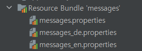

- **Controller**

```java
@GetMapping(path = "/hello-world-internationalized")
public String helloWorldInternationalized(@RequestHeader(name="Accept-Language",required = false)
Locale locale){

return messageSource.getMessage("greeting.message",null, locale);
}

```

- **Postman**

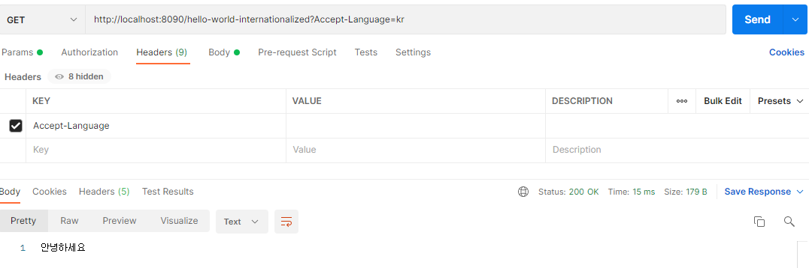

## Response 데이터 형식 변환 - XML format

- **pom.xml  xmlformat도 가능한 dependency 추가**

```xml
<dependency>
    <groupId>com.fasterxml.jackson.dataformat</groupId>
    <artifactId>jackson-dataformat-xml</artifactId>
    <version>2.10.2</version>
</dependency>
```

- postman에서  applicatoin/xml 요청시

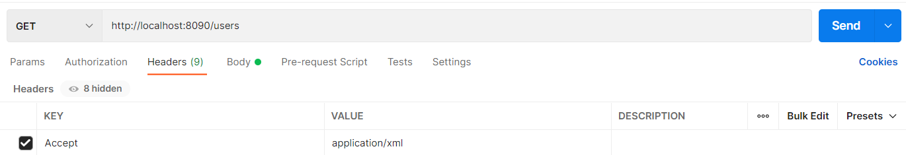

xml 파일로 출력

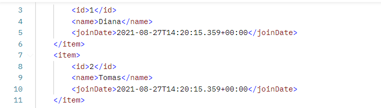

## Response 데이터 제어를 위한 Filtering

필드의 데이터 값을 외부에 노출 싶지 않을 경우

**@JsonIgnore**을 사용하여 노출하지 않는다. 혹은

**@JsonIgnoreProperties(value={"제외 변수 값"})**

을 통해 변수, 혹은 필드 단위의 노출 제한 범위 설정

```java
@Data
**@AllArgsConstructor**
@JsonIgnoreProperties(value={"password"})
public class User {

    private Integer id;

    @Size(min=2, message = "Name은 2글자 이상 입력해 주세요")
    private String name;

    @Past
    private Date joinDate;

//JsonIgnore
    private String password;

    private String ssn;
```

## 프로그래밍으로 제어하는 Filtering 방법 - 개별 사용자 조회

관리자가 들어갈 수 있는 url을 추가하여, 원하는 필드값을 출력해 보자

1.  JsonFilter추가

```java
@Data
@AllArgsConstructor
//@JsonIgnoreProperties(value={"password"})
@JsonFilter("UserInfo")
public class User {

    private Integer id;

    @Size(min=2, message = "Name은 2글자 이상 입력해 주세요")
    private String name;

    @Past
    private Date joinDate;

    private String password;

    private String ssn;
```

@JsonFilter : Filter ID를 문자열로 지정한다. 일단 이 애노테이션을 사용하면 무조건 FilterProvider와 해당 ID를 처리하는 필터를 제공해야 한다.

그래서 Controller에서 이를 처리하는 필터 제공을 한다.!!

- adminUserController

```java
@GetMapping("/users/{id}")
    public MappingJacksonValue retrieveUser(@PathVariable int id){
        User user = service.findOne(id);
        if(user == null){
            throw new UserNotFoundException(String.format("ID[%s] not found",id));
        }

        //가져올 값에 대한 필터 생성
        SimpleBeanPropertyFilter filter = SimpleBeanPropertyFilter
                .filterOutAllExcept("id","name","joinDate","ssn");

        //필터 추가
        FilterProvider filters = new SimpleFilterProvider().addFilter("UserInfo",filter);

        MappingJacksonValue mapping = new MappingJacksonValue(user);
        mapping.setFilters(filters);

        return mapping;
    }
```

이 부분이 약간 어려웠던 부분!

- MappingJacksonValue

A simple holder for the POJO to serialize via

`[MappingJackson2HttpMessageConverter](https://docs.spring.io/spring-framework/docs/current/javadoc-api/org/springframework/http/converter/json/MappingJackson2HttpMessageConverter.html)`

along with further serialization instructions to be passed in to the converter.

On the server side this wrapper is added with a `ResponseBodyInterceptor` after content negotiation selects the converter to use but before the write.

On the client side, simply wrap the POJO and pass it in to the `RestTemplate`.

```java
SimpleBeanPropertyFilter filter = SimpleBeanPropertyFilter
                .filterOutAllExcept("id","name","joinDate","ssn");

```

### 전체 사용자 조회

위와같이 똑같은 필터를 사용하여 전체 사용자 호출 method에 사용

사용자 리스트를 mapping에 삽입

## URI를 이용한 REST API Version 관리

공개 api를 사용할때 사용자들한테 어떻게 나오는 지 알아보자⇒버전관리를 내용이 나온다

상속시 꼭 부모 클래스의 instance를 참고해서 생성해야하기때문에

User를 상속 받은 다른 객체(필드) 생성

```java
@Data
@AllArgsConstructor
//@JsonIgnoreProperties(value={"password"})
@NoArgsConstructor
@JsonFilter("UserInfo2")
public class UserV2 extends User{

    private String grade;

}
```

그리고 버전에 따른 controller 메소드에서 User - > UserV2로 바꾼뒤

```java
//User -> User2
        UserV2 userV2 = new UserV2();

        //두 유틸 안에 공통적인 필드(properties) 있으면 해당값 복사
        BeanUtils.copyProperties(user,userV2);
        userV2.setGrade("VIP");
```

- BeanUtils.copyProperties

## Request Parameter 와 Header를 이용한 API Version 관리

1.  URI
2. Request Parameter

⇒일반 브라우저에서 확인(실행가능)

1. Header
2. MINE 타입 (Multipurpose Internet Mail Extensions)
 

⇒ 일반 브라우저에서 실행 불가능 (postman등을 이용)

버전 API application 변경에대해서 표시하기 위해서도 표시해야한다.